# Diagram Alur Kerja Sistem Validasi Prestasi

## 1. Alur Utama Sistem (SSO SIKAD)

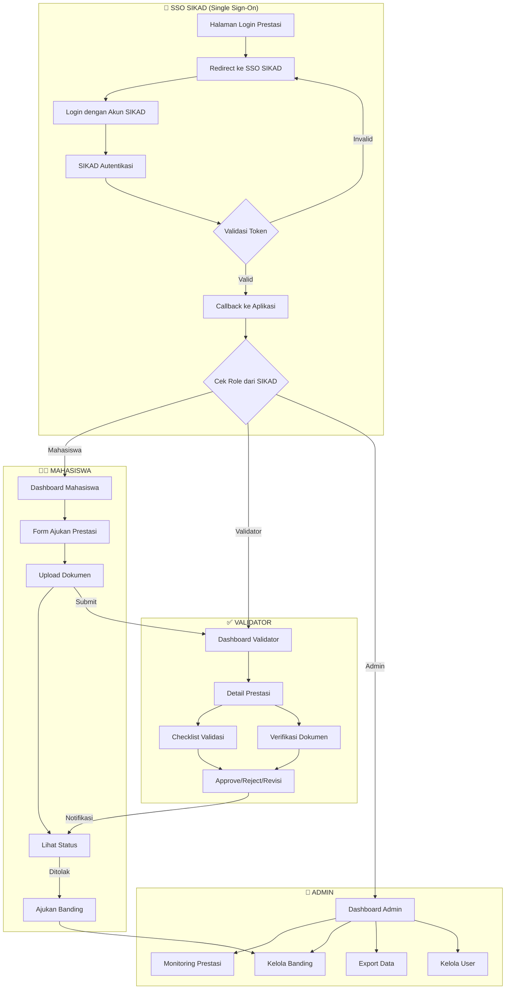

## 1.1 Detail Alur SSO SIKAD

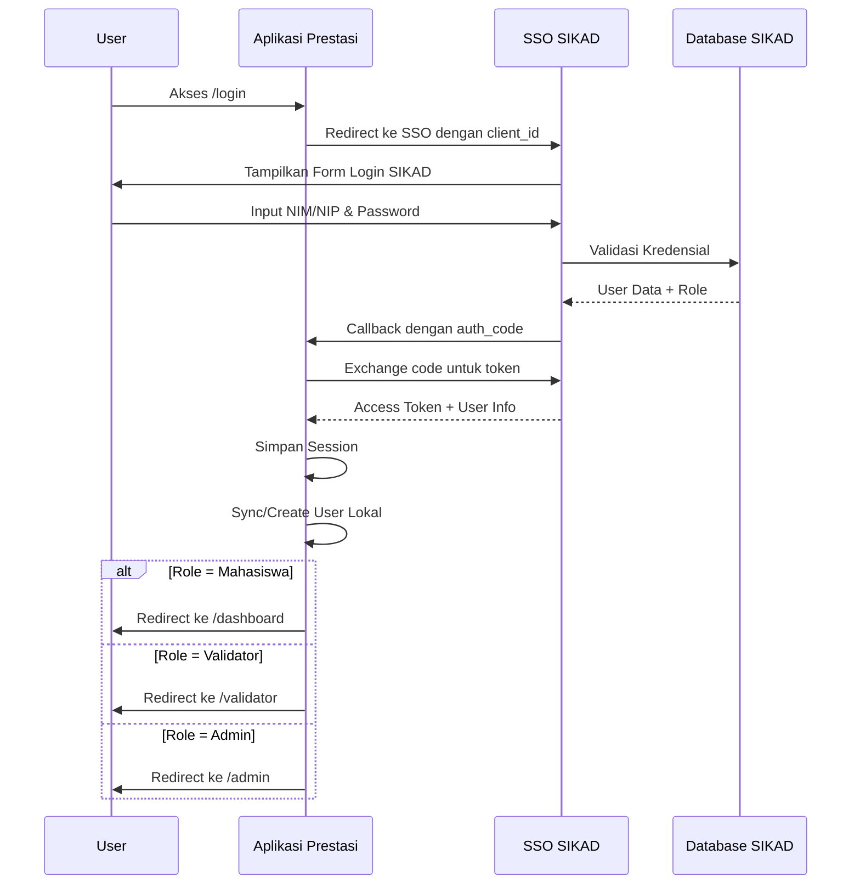

## 1.2 Mapping Role dari SIKAD

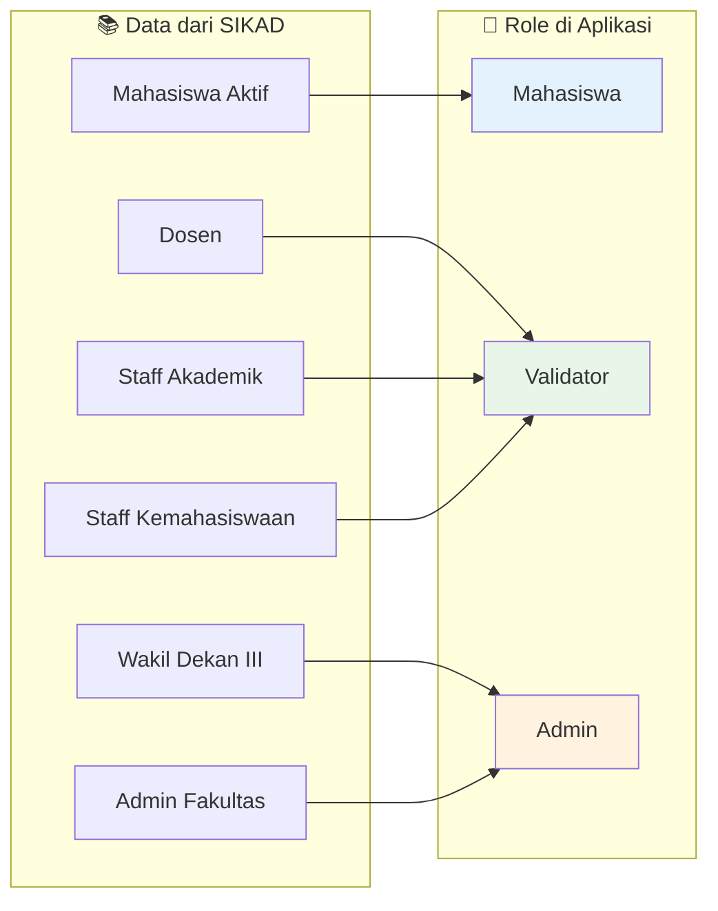

## 2. Alur Pengajuan Prestasi (Mahasiswa)

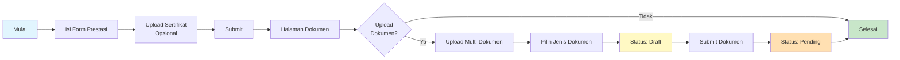

## 3. Alur Status Dokumen

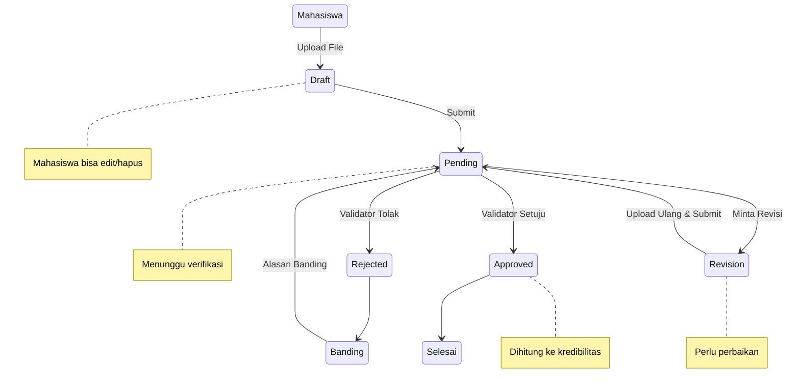

## 4. Alur Validasi (Validator)

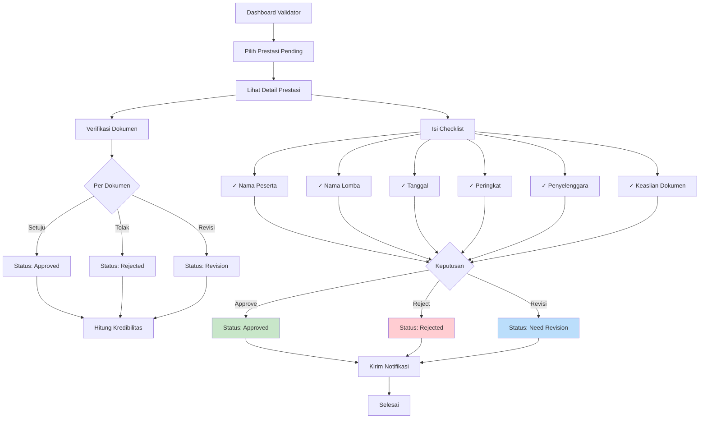

## 5. Alur Perhitungan Kredibilitas

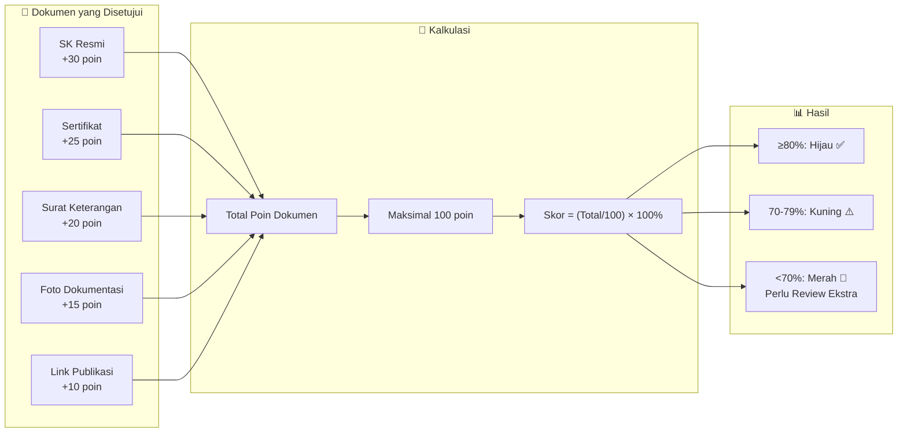

## 6. Alur Banding (Appeal)

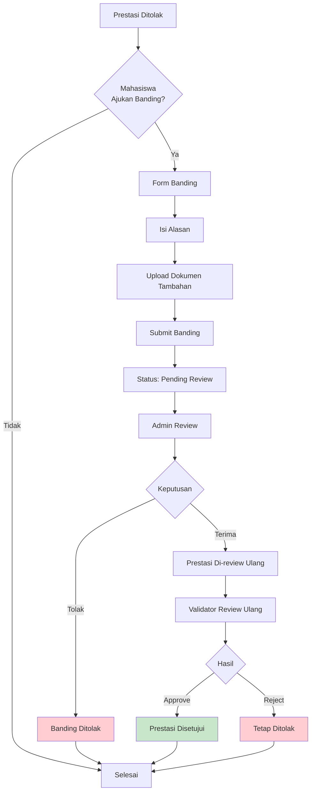

## 7. Struktur Halaman Web

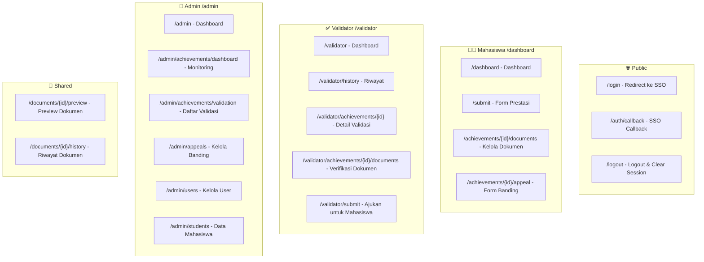

## 8. Arsitektur SSO Integration

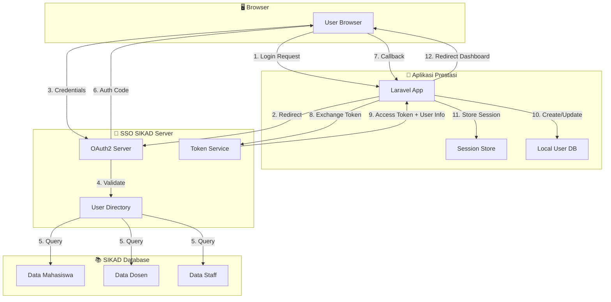

## 8. Database Entity Relationship

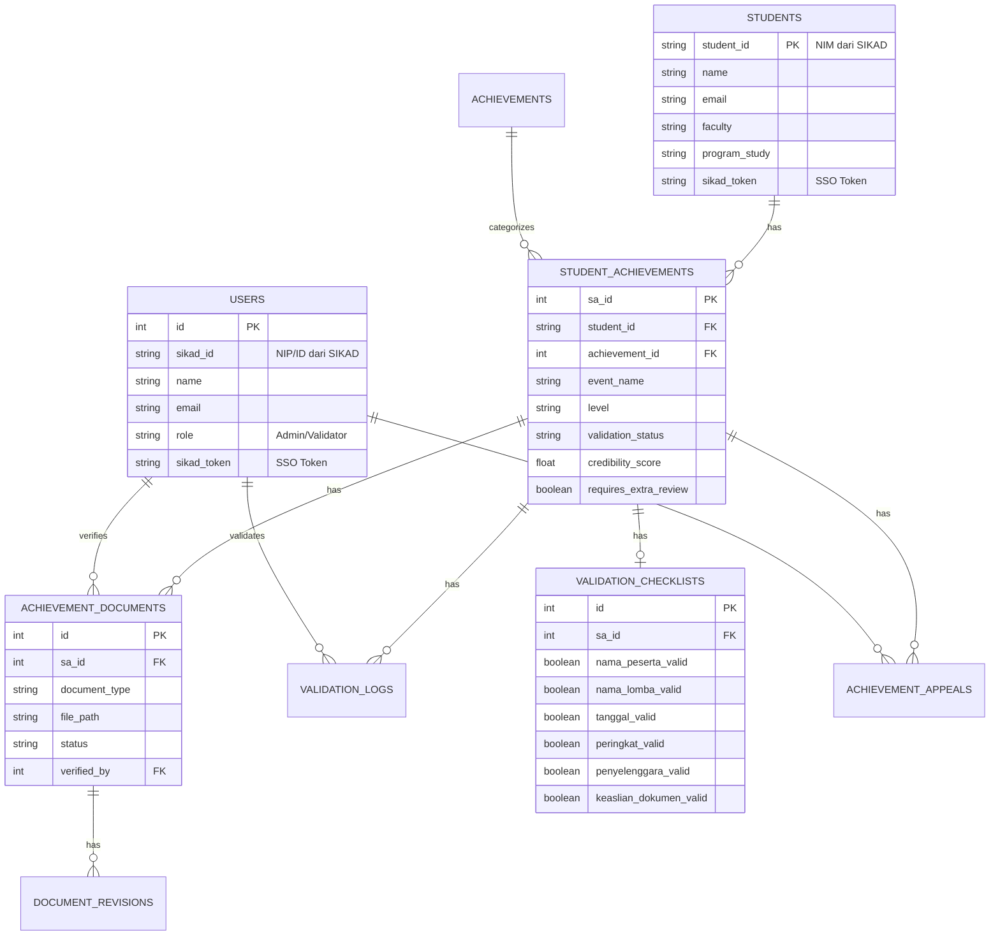

## 9. Konfigurasi SSO

```
# .env Configuration untuk SSO SIKAD

SIKAD_SSO_ENABLED=true
SIKAD_SSO_URL=https://sso.sikad.unpatti.ac.id
SIKAD_SSO_CLIENT_ID=prestasi-app
SIKAD_SSO_CLIENT_SECRET=your-secret-key
SIKAD_SSO_REDIRECT_URI=https://prestasi.unpatti.ac.id/auth/callback
SIKAD_SSO_SCOPES=openid,profile,email,role
```

## Legenda Status

| Status Prestasi | Warna | Keterangan |
|----------------|-------|------------|
| `pending` | 🟡 Kuning | Menunggu validasi |
| `approved` | 🟢 Hijau | Disetujui |
| `rejected` | 🔴 Merah | Ditolak |
| `need_revision` | 🔵 Biru | Perlu revisi dokumen |

| Status Dokumen | Warna | Keterangan |
|----------------|-------|------------|
| `draft` | ⚪ Abu-abu | Baru diupload, belum disubmit |
| `pending` | 🟡 Kuning | Menunggu verifikasi |
| `approved` | 🟢 Hijau | Disetujui, dihitung ke kredibilitas |
| `rejected` | 🔴 Merah | Ditolak |
| `revision` | 🔵 Biru | Perlu upload ulang |

---